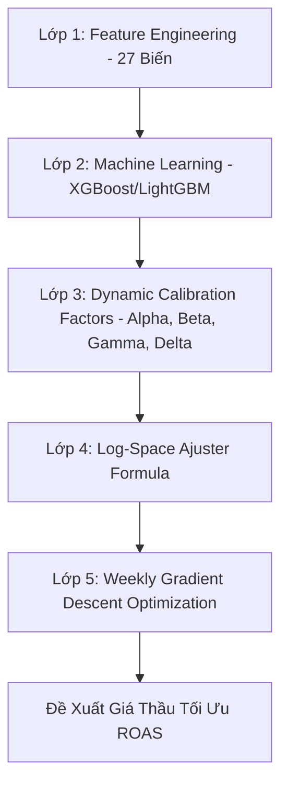

# 🚀 E-Commerce Crawler & AI ROAS Decision Engine Platform

Nền tảng tự động hóa thương mại điện tử tích hợp: cào dữ liệu Shopee, tối ưu SEO bằng trí tuệ nhân tạo (Gemini AI), kiểm soát ngân sách chiến dịch quảng cáo và định cấu hình giá thầu tối ưu bằng mô hình **AI ROAS Decision Engine**.

---

## 🗺️ Kiến Trúc Hệ Thống

Hệ thống được xây dựng trên mô hình Client-Server hiện đại, phân tách rõ ràng trách nhiệm giữa giao diện người dùng và động cơ xử lý logic:

1. **Frontend**: React + TypeScript + Vite. Thiết kế giao diện Glassmorphism cao cấp, tối ưu hóa trải nghiệm người dùng với các hiệu ứng chuyển động vi mô (micro-animations) mượt mà và khả năng hiển thị tương thích hoàn toàn trên mọi thiết bị (Responsive).
2. **Backend API**: Python FastAPI. Cung cấp các API Endpoint hiệu năng cao, tích hợp xử lý tác vụ nền (background tasks), kết nối cơ sở dữ liệu MySQL (qua SQLAlchemy ORM) và SQLite dự phòng khi chạy offline.
3. **Động cơ Cào Dữ Liệu (Crawler Engine)**: Playwright kết hợp BeautifulSoup bóc tách dữ liệu sạch từ Shopee qua cổng Chrome Debug 9222 hoặc cấu hình profile độc lập.
4. **Động cơ Định giá & Dự báo ROAS (AI Decision Engine)**: Sử dụng các mô hình học máy nâng cao kết hợp hiệu chỉnh toán học động để đưa ra đề xuất giá thầu tối ưu.
5. **Kênh Điều Khiển Bot Telegram**: Hỗ trợ tra cứu nhanh trạng thái và báo cáo lợi nhuận bằng cú pháp tự nhiên qua ứng dụng Telegram.

---

## 💎 Mô Hiện 5 Lớp AI ROAS Decision Engine

Hệ thống sở hữu động cơ dự đoán và hiệu chỉnh giá thầu thông minh cấu thành từ 5 lớp nghiệp vụ toán học & học máy chuyên sâu:



### 1. Lớp 1: Kỹ Nghệ Đặc Trưng Thời Gian (Feature Engineering)
Dữ liệu thô từ chiến dịch được làm giàu thông qua việc trích xuất và biến đổi thời gian để tạo ra **27 biến đặc trưng** (trước đây là 20).
* **7 biến thời gian mới**:
  1. `month`: Tháng chạy chiến dịch (1-12) giúp phát hiện xu hướng mùa vụ.
  2. `day_of_month`: Ngày trong tháng (1-31).
  3. `hour_of_day`: Khung giờ vàng chạy ads (0-23).
  4. `time_block`: Nhóm giờ cao điểm (ví dụ: giờ ăn trưa, giờ đi ngủ tối).
  5. `is_holiday`: Đánh dấu ngày lễ tết quốc gia (1/1, 30/4, 2/9, v.v.).
  6. `is_salary_period`: Chu kỳ nhận lương của khách hàng (thường từ ngày 25 đến ngày 5 đầu tháng sau).
  7. `days_to_flash_sale`: Số ngày còn lại đến sự kiện siêu sale kế tiếp của sàn Shopee (ví dụ: ngày đôi 9/9, 10/10, v.v.).

### 2. Lớp 2: Mô Hình Học Máy Dự Báo (Machine Learning Forecasting)
Mô hình sử dụng thuật toán **XGBoost Regressor** và **LightGBM Regressor** để dự đoán các chỉ số hiệu suất quảng cáo thô (raw metrics) dựa trên 27 biến đầu vào:
* Dự đoán chỉ số CTR thô ($\text{CTR}_{\text{raw}}$).
* Dự đoán chỉ số CVR thô ($\text{CVR}_{\text{raw}}$).
* Dự đoán doanh thu GMV và giá trị ROAS thô ($\text{ROAS}_{\text{raw}}$).

### 3. Lớp 3: Các Chỉ Số Hiệu Chỉnh Động (Dynamic Calibration Factors)
Để mô hình phản ứng nhanh với biến động tức thời của thị trường, hệ thống tính toán 4 chỉ số hiệu chỉnh động thời gian thực:
* **Hệ số Click $\alpha$**: Đo lường độ lệch giữa CTR trung bình 3 ngày gần nhất so với trung bình 30 ngày.
* **Hệ số Chuyển đổi $\beta$**: Đo lường độ lệch giữa CVR trung bình 3 ngày gần nhất so với trung bình 30 ngày.
* **Hệ số Mùa vụ $\gamma$**: Đánh giá ảnh hưởng của các ngày Lễ Tết lớn hoặc thời điểm Sale ngày đôi.
* **Chỉ số Hoàn trả $\delta$**: Đại diện cho tỷ lệ rủi ro trả hàng/hoàn tiền của sản phẩm đang chạy chiến dịch.

### 4. Lớp 4: Công Thức Hiệu Chỉnh Trong Không Gian Log (Log-Space Calibration Math)
Tích hợp các chỉ số hiệu chỉnh vào dự đoán thô của mô hình học máy bằng cách chiếu lên không gian log-space để đảm bảo tính ổn định toán học và tránh các giá trị cực trị âm:
$$\log(\text{ROAS}_{\text{adjusted}}) = \log(\text{ROAS}_{\text{raw}}) + w_1(\alpha - 1) + w_2(\beta - 1) + w_3(\gamma - 1) + w_4(1 - \dots)$$
Trong đó $w_1, w_2, w_3, w_4$ là trọng số tương ứng đại diện cho mức độ nhạy cảm của hệ thống đối với từng hệ số.

### 5. Lớp 5: Thuật Toán Tối Ưu Hàng Tuần (Weekly Gradient Descent Calibration)
Một tác vụ nền (background task) chạy định kỳ hàng tuần sẽ thực hiện tối ưu hóa các trọng số $w$ bằng phương pháp hạ cực tiểu hóa hàm lỗi Log-Loss hoặc Mean Squared Error (MSE) giữa giá trị ROAS hiệu chỉnh dự báo so với ROAS thực tế ghi nhận trong tuần qua:
$$\min_{w} \frac{1}{N} \sum_{i=1}^{N} \left( \log(\text{ROAS}_{\text{adjusted}, i}(w)) - \log(\text{ROAS}_{\text{actual}, i}) \right)^2$$
Quá trình này cập nhật các trọng số tự động vào cơ sở dữ liệu để áp dụng cho chu kỳ dự đoán tiếp theo.

---

## 📊 Bảng Điều Khiển ROAS Dashboard Mới
Giao diện quản lý ROAS giờ đây sở hữu tab Dashboard trực quan, tích hợp sâu dữ liệu chiến dịch:
* **KPI Cards cao cấp**: Theo dõi tổng doanh thu (GMV), tổng lợi nhuận ròng, tổng chi phí quảng cáo (Ads Cost), và ROAS trung bình toàn hệ thống.
* **Top 5 chiến dịch sinh lời tốt nhất**: Danh sách xếp hạng các sản phẩm mang lại dòng tiền ròng tối ưu nhất.
* **Biểu đồ thanh hiệu suất**: Hiển thị tỷ lệ CTR, CVR, và tỷ lệ hoàn hàng trung bình.
* **Trạng thái Model Registry**: Hiển thị thuật toán đang chạy (XGBoost/LightGBM) và độ chính xác R² hiện tại.

---

## 🤖 Tính Năng Bot Telegram Tra Cứu Lợi Nhuận
Hệ thống tích hợp bot điều khiển từ xa qua Telegram với câu lệnh `/profit` mạnh mẽ:
* `/profit`: Hiển thị báo cáo tổng quan toàn bộ hệ thống (Doanh thu, Lợi nhuận ròng, ROAS trung bình và Top 5 chiến dịch sinh lời).
* `/profit sp [Mã_Sản_Phẩm]`: Xem chi tiết số ngày chạy chiến dịch, GMV, Lợi nhuận ròng và ROAS trung bình riêng của một sản phẩm.
* `/profit date [YYYY-MM-DD]`: Xem doanh thu và lợi nhuận tạo ra trong ngày cụ thể.
* `/profit range [YYYY-MM-DD] [YYYY-MM-DD]`: Trích xuất báo cáo doanh số trong khoảng thời gian xác định.

---

## 🛠️ Hướng Dẫn Cài Đặt

### 1. Cài đặt Backend (Python)
Cài đặt các gói phụ thuộc yêu cầu cho hệ thống:
```bash
pip install fastapi uvicorn playwright beautifulsoup4 sqlalchemy pymysql requests python-dotenv xgboost lightgbm scikit-learn
playwright install chrome
```

### 2. Cài đặt Frontend (React)
Cài đặt các node packages:
```bash
npm install
```

### 3. Cấu hình Tham số Môi trường `.env`
Tạo file `.env` tại thư mục gốc dự án:
```env
# MySQL Database Configuration
DB_HOST=localhost
DB_PORT=3306
DB_USER=root
DB_PASS=
DB_NAME=shopee_db

# Telegram Config
TELEGRAM_BOT_TOKEN=your-bot-token
TELEGRAM_CHAT_ID=your-chat-id

# Gemini AI API Key
GEMINI_API_KEY=your-gemini-api-key
```

---

## 🚀 Cách Chạy Ứng Dụng

1. **Khởi động Backend API Server**:
   ```bash
   python -m uvicorn automation.api:app --host 0.0.0.0 --port 8000 --reload
   ```
2. **Khởi động React Frontend**:
   ```bash
   npm run dev
   ```
   Truy cập giao diện Web thông qua: `http://localhost:5173` (hoặc cổng được hiển thị trong terminal).

3. **Chạy Bộ Kiểm Thử Tích Hợp (API Tests)**:
   ```bash
   python test_all_features.py
   ```

---

## 🧑‍💻 Bản quyền & Đóng góp
Được phát triển bởi **Antigravity Advanced Coding Agent** phối hợp cùng nhóm phát triển AI Google DeepMind.
